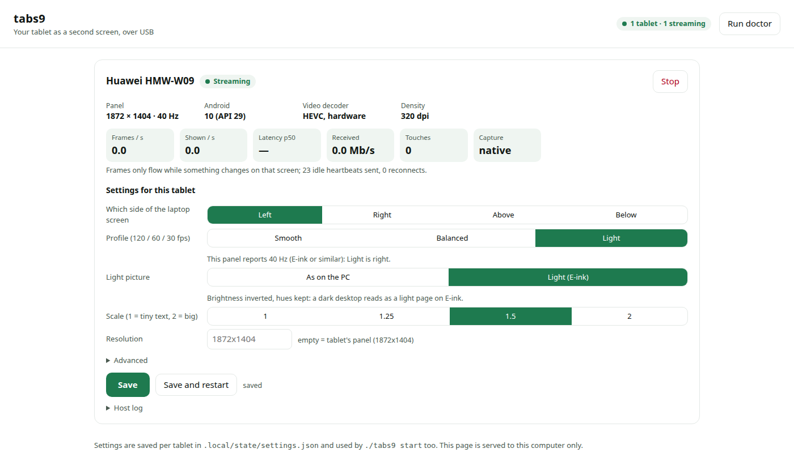

# tabs9 — your tablet as a second screen, over USB

**tabs9** turns an Android tablet into a **real extended monitor** for a Linux
laptop over a USB cable — or two tablets into two monitors. The host creates a KDE virtual output, captures it through PipeWire
as a DMA-BUF, converts and compresses it on the same Intel GPU with VA-API HEVC
(zero copies, no readback) and sends it through authenticated loopback sockets
forwarded by ADB. Touch and pen come back through KDE's RemoteDesktop portal
and are delivered to the desktop with libei. No root, no kernel module, no
Wi-Fi, no system-wide installation: everything the tools download lives under
`.local/` in this directory.

**Tested hardware — the only combinations that have ever run this.** One
laptop: **Ubuntu 26.04, KDE Plasma 6.6.6 on Wayland, Intel Core Ultra 7 155H
with its Arc iGPU (i915)**; an NVIDIA RTX 4050 is present but idle in the
recommended mode. Two tablets:

| Tablet | Panel | What was verified | Notes |
|---|---|---|---|
| **Samsung Galaxy Tab S9 Ultra** | 2960 × 1848, 120 Hz | Everything in this file: 60/120 Hz numbers, touch, pen, gestures, remote control | Every number in [docs/performance.md](docs/performance.md) comes from this pair |
| **Huawei MatePad Paper** HMW-W09 (HarmonyOS 2.1 = Android 10, Kirin 820E), **E-ink** | 1872 × 1404, 40 Hz | Mirroring and touch, 2026-09-19; both tablets streaming at the same time as two extra monitors | `--profile light` (30 fps); frame rate is irrelevant on E-ink and was not measured. Its HEVC decoder holds frames until the next one arrives (see [Limitations](#limitations)); the host now works around it. Not Samsung, so no S Pen button/air gestures; remote control not tried |

## Requirements

Read this before anything else; the project is hardware-specific.

**Host**

- Linux with **KDE Plasma 6.6 on Wayland**: the host uses
  `xdg-desktop-portal-kde` (virtual output creation, screen capture,
  RemoteDesktop), `kscreen-doctor` (output placement and modes) and KWin's
  EIS backend for input. GNOME, Sway, Hyprland and X11 sessions are **not
  supported**.
- **Intel GPU, Gen12 or newer** (Tiger Lake / Arc / Meteor Lake and later)
  with the iHD VA-API driver and GStreamer's `vah265enc`. The native capture
  helper hard-codes the Intel `I915_FORMAT_MOD_4_TILED` DMA-BUF modifier and
  is the only path that reaches the numbers below. AMD-only machines are
  **not supported** today; on an NVIDIA-only machine only the slow reference
  path (`--capture-memory system`, CPU readback → NVENC, ~30 fps) exists.
- PipeWire ≥ 1.0, Python 3 with `gi` (GStreamer typelibs), `dbus`,
  `websockets` ≥ 13, and `libei` (`libei.so.1`; on Ubuntu the `libei1` package,
  pulled in by Xwayland).
- `scripts/setup-native.sh` unpacks headers (and `wl-clipboard`, for the
  tablet-to-PC clipboard) with `apt-get download`, so it is
  Debian/Ubuntu-only; on other distributions build `native/tabs9-capture`
  against your own `libpipewire-0.3`, `libva`, `libdrm` headers with
  `make -C native SYSROOT=/usr/include` and install `wl-clipboard`.
- A USB 3 **data** cable.

**Tablet**

- Any Android 8.1+ tablet with a hardware HEVC decoder and USB debugging
  enabled should work in principle: the host asks the connected tablet for
  its panel size (`--resolution WIDTHxHEIGHT` overrides it) and the client
  negotiates frame rate and bitrate from the host. Two tablets have been
  verified (table above); `./tabs9 setup` reports what yours has.
- The client APK is debug-signed. `./tabs9 setup` downloads the release
  tagged with the source's own app version (`v0.2.0` for a checkout whose
  `android/app/build.gradle.kts` says `versionName = "0.2.0"`), checks the
  SHA-256 published in the release notes and installs it; the two therefore
  never drift apart. `scripts/build-android.sh` builds the same APK from
  source (downloads a JDK and the Android SDK, ~1 GB) for anyone changing
  the app.
- **The app's own screens** (start-up, settings, the one-time note) use a
  green palette in a dark and a **light variant for E-ink**: *Settings →
  Theme* is Auto / Light (E-ink) / Dark. Auto picks Light when the panel
  looks like E-ink — a known model, or a refresh rate of 45 Hz or less, which
  no LCD/OLED tablet reports (the MatePad Paper says 40 Hz; there is no
  Android API that states the panel technology, so this stays a guess you
  can override). The *mirrored desktop* keeps whatever colours KDE has: for
  an E-ink tablet, a light Plasma colour scheme is the setting that matters.

The name comes from the first tablet it ran on. The CLI is `./tabs9`, each
tablet's host runs as the systemd user unit `app-tabs9.<model>.service`
(`app-tabs9.sm_x910.service`, `app-tabs9.hmw_w09.service`), the Android app
id is `local.tabs9.usbdisplay`.

## Quick start: one command

```sh
git clone https://github.com/GliAcopo/tablet-usb-monitor.git
cd tablet-usb-monitor
./tabs9 setup          # walks through everything below, then prints the start line
./tabs9 ui             # control panel in the browser: Start, settings, status …
./tabs9 start          # … or the command line, e.g. ./tabs9 start --profile light
```

On a machine that already has the packages, `./tabs9 setup --yes` is
hands-off from a fresh clone to an app on the tablet (verified: it downloads
ADB, builds the capture helper, fetches the release APK, checks its SHA-256,
installs it and answers the tablet's own prompts — no sudo asked when nothing
is missing).

`./tabs9 setup` is a guided installer and a doctor in one. It goes through
eight steps in order and, at each one, says what it found, what it is about
to do, and — when only you can do it — exactly what to do on the tablet,
then waits and checks again:

1. **Desktop session** — KDE Plasma on Wayland (nothing else can work; it
   tells you to log out and pick "Plasma (Wayland)").
2. **Host packages** — probes every library and GStreamer element the host
   needs and offers **one `sudo apt-get install` line** for the missing ones
   (it asks first; `--no-sudo` prints the line instead; `--yes` accepts).
   On non-Debian systems it lists what to install by hand.
3. **GPU access** — the render nodes are readable, VA-API sees an HEVC
   encoder on the Intel GPU; offers to add you to the `render` group.
4. **ADB** — a checksum-pinned `platform-tools` under `.local/`, nothing
   system-wide.
5. **Native capture helper** — builds `native/tabs9-capture` (headers are
   unpacked under `.local/sysroot`, no system change).
6. **Tablet on USB** — see [Preparing the tablet](#preparing-the-tablet):
   it tells apart *no tablet on the bus* (cable/port), *tablet but no ADB
   interface* (USB debugging off or "charge only"), *ADB without permission*
   (offers a udev rule with sudo), *unauthorized* (the prompt on the tablet)
   and *authorized*; then reports model, Android version, panel size, refresh
   rate and whether a hardware HEVC decoder exists. Model names yes, serial
   numbers never.
7. **Client app** — downloads the release APK (SHA-256 checked against the
   release notes) or uses your build, installs it when the tablet runs a
   different build, and answers the tablet's own install prompts for you
   (Huawei shows two for every ADB install).
8. **KDE consent** — whether the two portal dialogs are already remembered.

It ends with the exact `./tabs9 start` line for your tablet (30 fps profile
for panels under 55 Hz such as E-ink, 60 fps otherwise; `--pen-button off`
off Samsung). `./tabs9 setup --start` runs it. `./tabs9 doctor` runs the
same checks **read-only** — nothing installed, nothing waited for — and
prints the fix next to every failure; paste its output in bug reports.

`setup` never loads kernel modules, changes the firewall, enables autostart
or sends power/lock keys to the tablet. Its only privileged actions are the
package install and the udev rule, each after a yes. Outside this directory
tabs9 only ever writes the per-tablet desktop entries described under
[Two tablets at once](#two-tablets-at-once) (`./tabs9 forget` removes them). The Android toolchain
(JDK, SDK, Gradle caches) for `scripts/build-android.sh` lives under
`.local/android-toolchain`. The motion test additionally needs PyQt6. The
control protocol between host and client is described in
[android/README.md](android/README.md).

### Preparing the tablet

Read this once; `./tabs9 setup` repeats the relevant part whenever it is
stuck on it. Nothing here is specific to this project — it is how any ADB
tool talks to an Android device — but every one of these steps has cost
somebody an afternoon.

1. **Enable Developer options.** Settings → *About tablet* (About device /
   About phone; on Samsung: *Software information*) → tap **Build number**
   seven times until it says "You are now a developer".
2. **Turn on USB debugging.** Settings → *System* (or *System & updates*) →
   *Developer options* → **USB debugging: on**. Leave everything else in
   Developer options alone.
3. **Use a data cable, straight into the computer.** A charging-only cable
   shows *nothing* on the USB bus, not even an error. Skip hubs for the
   first attempt. USB 2 (480 Mbit/s) is enough for the 30 fps profile; a
   USB 3 port and cable give 5 Gbit/s for 60/120 Hz.
4. **Set the USB mode to file transfer.** Pull down the notification shade,
   tap the *USB* / *Charging this device* notification and choose
   **File transfer / Transfer files (MTP)**. In *Charge only* mode most
   tablets hide the ADB interface, so the computer sees a charger.
5. **Authorize this computer.** With the tablet unlocked, the first ADB
   contact shows **"Allow USB debugging?"** with the computer's key
   fingerprint. Tick **Always allow from this computer** and tap Allow/OK.
   No prompt? Unplug and replug; or in Developer options tap *Revoke USB
   debugging authorizations* and replug. Some tablets show a second question
   when the cable goes in — *allow this computer to access the tablet's
   data* (Samsung) — allow that too, it is the file-transfer mode.
6. **Let the app install.** `adb install` is confirmed on the tablet by some
   vendors: Huawei/Honor show a warning about apps from unknown sources
   (*Continue*) and then their own install screen (*Install*); `./tabs9
   setup` taps both for you (only the package installer's own button, found
   through the accessibility tree — nothing else on the screen). Xiaomi
   requires *Install via USB* in Developer options (needs a Mi account) and
   the install is refused otherwise; the doctor prints the message.
7. **Keep the tablet awake and unlocked** while it connects. The host opens
   the app itself and the app keeps the screen on while streaming.

Touch works out of the box: the app reads touches on its own surface and
sends them to the host; no accessibility service, no *USB debugging (Security
settings)* and no root are needed. Remote control of the tablet from the PC's
mouse and keyboard (a separate, optional feature, Samsung-tested only) is the
one thing that needs the extra `scripts/tabs9-remote/build-and-push.sh`.

### First start

The first start of each tablet shows two KDE dialogs — "Share virtual screen"
and the RemoteDesktop/ScreenCast approval. Leave "Allow restoring on future
sessions" ticked in both: the host stores the restore tokens under
`.local/state/portal_tokens-<model>.json` and every later start of that
tablet is silent. The host launches the app on the tablet itself over ADB;
`./tabs9 status`, `./tabs9 logs` and `./tabs9 stop` do what they say.
`--profile balanced` (native resolution, 60 Hz, HEVC 30 Mbit/s) is the
measured usable mode on the Tab S9 Ultra; `--fps 120` is available and
reaches 110–113 fps; `--profile light` (30 fps, 15 Mbit/s) is right for
E-ink and other slow panels. Without `--resolution` the host uses the panel
size the connected tablet reports.

### The control panel: `./tabs9 ui`



`./tabs9 ui` starts the panel as a user service (`app-tabs9.ui.service`,
`./tabs9 ui --stop` ends it), serves it on `http://127.0.0.1:8899` (this
computer only) and opens it in your browser; run it again and it just
brings the page up. `./tabs9 launcher` adds **tabs9** to the application
launcher with its icon — find it there, right-click → *Pin to Task Manager*
for a one-click panel. One card per attached tablet: its state
(stopped / waiting for the KDE dialog / streaming / failed), **Start** and
**Stop**, what the tablet is (panel, refresh rate, Android version, whether
it has a hardware HEVC decoder), live figures while it streams (frames per
second, frames shown on the tablet, latency, received bit rate, touches),
its **settings** — which side of the laptop screen, profile, text size,
resolution, and under *Advanced* frame rate, bitrate, gestures, scrolling,
two-finger tap, S Pen button, remote control, capture path — the host log,
and a **Run doctor** button that shows the same report as `./tabs9 doctor`.
It is plain HTML and JavaScript served by Python's standard library, so it
renders in any browser and needs no framework or build step.

Settings are **remembered per tablet** in `.local/state/settings.json`
(model names, never serials) and applied by `./tabs9 start` as well, so the
Tab S9 can live on the left at 60 fps and the E-ink tablet on the right at
30 fps, every time, with no options typed. Anything typed on the command
line still wins. *Save and restart* applies a change to a running tablet.

### Where the tablet goes: `--side`

`--side left|right|top|bottom` (default right; the *Side of the laptop
screen* buttons in the panel) places the virtual output next to the laptop
screen. Right and bottom only add the output; left and top put the tablet at
the origin and **move the laptop screen over** for the duration — KDE keeps
the layout's top-left corner at (0, 0) — nudged so the laptop stays on whole
device pixels at its own scale; the host puts it back where it was when it
stops.

### Two tablets at once

Every attached tablet gets its own host: `./tabs9 start --tablet SM` and
`./tabs9 start --tablet HMW` (a model name, or part of one; with a single
tablet attached `--tablet` is not needed). Each instance has its own systemd
unit (`app-tabs9.<model>.service`), status file, lock, listening ports (the
first takes 8890–8892, the next 8894–8896, …; the app always dials 8890/8891
on the tablet and `adb reverse` maps them) and portal tokens. `./tabs9
status`, `./tabs9 stop` and `./tabs9 logs` cover every instance; add
`--tablet` for one. `./tabs9 setup` prepares every attached tablet in one
run.

Two things had to change for this to work on KDE, both invisible in normal
use: every adb call names its device (`adb -s`, never `-d`), and the unit
is named `app-tabs9.<model>.service` so that xdg-desktop-portal derives an
app id (`tabs9.<model>`) for each host. Without an app id KWin names every
virtual output `Virtual-virtual-xdp-kde-`, identical, and KScreen — which
addresses outputs by name — applied the second tablet's mode to the first
tablet's output as well (observed: the Tab S9's 2960×1848 output switched
to 1872×1404 and its capture stream died with "no more input formats").
With per-host app ids the outputs are `Virtual-virtual-xdp-kde-tabs9.sm_x910`
and `…hmw_w09`, the host tracks them by KScreen id, and portal restore
tokens are per app id, hence per tablet. The portal accepts a unit-derived
app id only when a desktop entry of that name exists, so `./tabs9 start`
writes a hidden one per tablet to `~/.local/share/applications/tabs9.<model>.desktop`
(it also names the host in KDE's dialogs). That is the only thing tabs9
puts outside its own directory; `./tabs9 forget` removes them.

## Measured results (2026-09-12, commit 3243ed3, one machine)

All of the following were measured on the Tab S9 Ultra with the synthetic OpenGL
motion pattern on the virtual output (`scripts/gpu-motion-test.py`); nothing
private was captured.

- USB debugging authorized, wired link negotiated at 5 Gbit/s.
- Separate extended output, native 2960 × 1848, 120 Hz mode, scale 1.5,
  placed to the right of the laptop panel.
- **Visible pixels confirmed**: a tablet screenshot shows the synthetic pattern
  rendered on the virtual output at 2960 × 1848.
- **Frame rate, default `--capture-memory native`** (3 fresh runs each,
  10 s warm-up + 60 s, `./tabs9 bench-capture`): at 60 Hz **59.3 / 59.1 /
  59.8 unique fps**, tablet render interval p95 20–22 ms, capture→ack p95
  27–28 ms, no stalls over 100 ms, ~9 % of one core. At 120 Hz 112.5 / 110.6 /
  111.1 fps, render p95 11.7 ms, capture→ack p95 23 ms — the missing ~6 %
  are frames KWin does not record at 120 Hz on this output (the same 111
  fps appears with capture → discard and no pipeline at all). The earlier
  GStreamer-only path was bistable (either ~59 or a stable 30 fps); the
  mechanism and the fix are in [docs/performance.md](docs/performance.md).
- **30-minute soak at the usable mode** (`--profile balanced`, taps every
  15 s): 58.2 unique fps mean and median (worst 5 s window 56.4, during an
  APK build on the same laptop), capture→ack p95 27 ms (worst window 33),
  render p95 20 ms (worst 24), 0 stalls, 2868 input messages, 0 rejected.
  With the bitrate doubled to 60 Mbit/s the tablet receives 59 Mbit/s and
  capture→ack p95 drops to 22 ms: the ADB transport has ≥ 2× headroom.
  **2026-09-13:** the picture dropping to the app's startup screen every
  few minutes was an idle desktop misread as a dead link (KWin sends no
  frame while nothing changes; the app's 10 s read deadline fired). Fixed
  with a negotiated video heartbeat and an explicit recovery state; a 27 min
  motion/idle soak, 15 fault drills (socket loss both sides, decoder
  rebuild) and a held-pinch-through-drop touch check are in
  [docs/performance.md](docs/performance.md). Rebuild the APK and restart
  the host together: an old app with a new host keeps working (no
  heartbeat is sent unless the app asks for it).
  Background/foreground, host restart under a live app, and an app frozen
  for 3 s under load (host and app resync paths both fire) all recover on
  their own within one 5 s window.
- For comparison on the same run type: `system` (CPU readback → NVENC)
  reached 30–36 fps and stalled the compositor itself to ~80 fps;
  `gl` (cross-GPU DMA-BUF import → NVENC) 13 fps. The encoder was never the
  limit; moving the frame off the Intel GPU was. See
  [docs/performance.md](docs/performance.md).
- **Touch confirmed end-to-end**: taps, drags, a two-finger pinch
  (`scripts/mt-inject`) and S Pen tap/stroke delivered on the tablet arrive
  as native Wayland touch/pointer events in a window on the virtual output —
  11/11 contacts in the expected 3×3 zones (corners, centre), 2 touch points
  during the pinch, 0 of 690 input messages rejected. This needed libei — see
  "Touch" below; the pen rides on the same libei device as an absolute
  pointer because KDE 6.6 refuses the portal's `NotifyPointer*` calls on this
  session.
- Consent: **both** portal dialogs are skipped after the first approval via
  stored restore tokens (verified live 2026-09-12: after one accepted "Share
  virtual screen" dialog, `stop`/`start` went straight to streaming twice,
  input mode `touchscreen-eis-ready`, nobody at the keyboard).
- Host → tablet settings sync and tablet → host input transport verified as
  before.

**Read together with the 2026-09-13 fix.** The runs above were recorded on a
boot where `/dev/dri/renderD128` happened to be the Intel GPU. Commit
`ee99d17` made the helper take the render node from the VA encoder instead of
assuming it (on a hybrid laptop the numbering changes across boots, and the
silent fallback landed on a slower path). Two fresh 30 s runs after the fix,
same profile, same synthetic motion: **56.8 / 56.6 unique fps**, capture→ack
p95 31.1 / 30.9 ms (worst window), render p95 22.6 / 21.8 ms, 0 stalls, no
fallback. Those are the figures a fresh install should reproduce; the
59.x runs and the 30-minute soak stand as recorded. Details and the
reproduction command are in [docs/performance.md](docs/performance.md).

## Other platforms

The Android app and the protocol are host-independent; the host is KDE
Wayland only. What a Windows `.exe` or a macOS `.app` would take — virtual
display driver vs. private API, capture, encoding, and why touch injection is
easy on Windows and impossible on macOS — is worked out in
[docs/ports.md](docs/ports.md).

## Limitations

- **Two tested tablets, one laptop.** Tab S9 Ultra and MatePad Paper (E-ink)
  with the laptop above. Other tablets and other Intel machines are expected
  to work but nobody has tried; `./tabs9 doctor` output is welcome.
- **Some tablet decoders hold a frame** until the next one is queued (the
  MatePad Paper's `OMX.hisi.video.decoder.hevc` does). KWin sends nothing
  while the desktop is static, so the last picture would stay inside the
  decoder. The host re-feeds the last frame (identical, a few KB) when the
  capture goes idle until the tablet reports it rendered — at most four
  times, and zero times on a decoder that outputs at once, such as the Tab
  S9's. `keyframe_replays` in `./tabs9 logs` counts them.
- **E-ink**: the panel presents a frame in 1–3 s and reports 40 Hz; use
  `--profile light`. The frame-rate figures in this file do not apply.
- **KDE Plasma Wayland only**, Intel GPU only for the usable path (see
  Requirements).
- **120 Hz mode delivers 110–113 fps**, not 120: KWin records that many frames
  on this output even with capture → discard and no pipeline at all.
- **Pen-only mode** (tablet as a graphics tablet for the laptop's own screen)
  is not implemented; the host tells the client so rather than ignoring it.
- Video is compressed HEVC; perfect pixel preservation is not promised. The
  tablet's USB port does not become a DisplayPort input.
- The APK is debug-signed and not on any store.

## Gaming on the tablet (read before trying)

Not benchmarked with a real game; what follows combines the pipeline design
with the synthetic-motion measurements above. See
[docs/performance.md](docs/performance.md#games-and-hybrid-gpus-not-measured)
for the reasoning.

- **The tablet does not add a GPU hop.** On a hybrid laptop (Intel iGPU +
  NVIDIA dGPU) KWin composites on the Intel GPU and a game rendered on the
  NVIDIA GPU (`prime-run`) already hands every frame to the Intel side, for the
  built-in panel too. The virtual output is composited there like any monitor;
  the extra work is colour conversion and HEVC encoding on the Intel **media
  engine** (fixed-function, ~3–4 ms + ~7 ms per frame), not on the 3D units.
  The NVENC route was tried and rejected: it forces a cross-GPU readback.
- **Frame rate:** the game's own fps are not touched by the encoder. The
  virtual output delivers a solid 59–60 fps at 60 Hz and ~111 fps at 120 Hz;
  cap the game there, anything faster is heat for nothing.
- **Latency is the real cost.** A frame appears on the tablet roughly
  35–50 ms (2–3 frames at 60 Hz) after KWin rendered it: capture → tablet
  acknowledgement p95 22–28 ms plus tablet decode/render p95 12–22 ms.
  Playing with the laptop's mouse and keyboard while watching the tablet keeps
  the game's input path unchanged — only the picture is late. Touch control
  goes through the portal and adds its own delay. Fine for casual,
  turn-based and strategy games; not for competitive shooters or rhythm games.
- **Thermals:** both GPUs and the media engine busy in one chassis.
- **Unmeasured:** the per-frame PCIe import of a large dGPU buffer while KWin
  also composites the laptop screen. To get a number, run the game with
  `prime-run` on the tablet and read `./tabs9 logs` (unique fps, capture→ack
  p95) while it runs; no restart or setting change is needed.

## Reporting problems

Run `./tabs9 doctor` first: it names the failing step and the fix. If that
is not enough, open an issue with its output, `./tabs9 logs`, your Plasma
and GPU model, and the tablet model. Both commands avoid device serials,
tokens and screen content by design; check anyway before pasting.

## Start and stop

Recommended launch (the measured usable mode: native resolution, 60 Hz,
HEVC 30 Mbit/s, native capture):

```sh
./tabs9 start --profile balanced      # add --tablet MODEL with two tablets attached
./tabs9 status                        # every running tablet
./tabs9 logs                          # add --tablet MODEL for one
./tabs9 stop                          # all, or --tablet MODEL
```

`./tabs9 start --profile balanced --fps 120` selects the 120 Hz output mode
(measured 110–113 fps, lower latency, ~15 % of a core). The native capture
helper must be built once with `scripts/setup-native.sh`; without it the host
falls back to the GStreamer `va` path, which is subject to the half-rate
state described in the performance report.

If the pointer sticks for a moment when it crosses between the laptop and
the tablet, that is KWin's edge barrier (Plasma 6.1+, 100 px by default);
disable it with `kwriteconfig6 --file kwinrc --group EdgeBarrier --key
EdgeBarrier 0`, `... --key CornerBarrier false`, then `qdbus6 org.kde.KWin
/KWin reconfigure` (undo: the same two commands with `--delete`).

`./tabs9 start` is **supervised**: it waits (up to 60 seconds) for the host to
reach a terminal state (streaming, failed, or stopped) or a consent-needed
phase, instead of printing "started" the moment `systemd-run` succeeds. It
prints precise instructions about the two consent dialogs.

KDE requires two portal sessions in this implementation:

1. **"Share virtual screen"** creates the output. The host places it to the
   right of all existing physical monitors, using non-negative logical
   coordinates derived from the current desktop layout.
2. A RemoteDesktop + ScreenCast session captures it and grants input. On KDE
   this dialog has **no screen chooser** — it only asks to approve "see what's
   on the screen" and "control input devices". `xdg-desktop-portal-kde`'s
   RemoteDesktop portal never shows one: with `multiple=false` and more than
   one screen it streams the *whole workspace*, with `multiple=true` it
   streams one PipeWire node per screen. The host therefore asks for all
   screens and selects the node whose geometry is the virtual output; the
   laptop's node is never consumed (KWin does not render into an unconnected
   stream).

The first session keeps the output alive. The second captures its independent
logical desktop and authorizes touch. There is only one video encoder and one
transmitted video stream.

### Touch: why libei and not the portal's NotifyTouch calls

`xdg-desktop-portal-kde` 6.6.6 forwards `NotifyTouchDown/Motion/Up` to KWin's
fake-input protocol but never sends `touch_frame`; Wayland clients (Qt, GTK,
Chromium) only dispatch touch on a frame, so those touches reach no window.
It also ignores the `stream` argument and forwards the coordinates as
workspace-global, while `xdg-desktop-portal` validates them stream-relative,
so they can only ever land on whichever output sits at the origin. Both were
reproduced live. The host instead calls `RemoteDesktop.ConnectToEIS` on the
same consented session and drives KWin's EIS backend through libei
(`src/eis_touch.py`, ctypes, no extra permissions): KWin exposes one absolute
device with a region per output, and every contact is framed. Pen input
still uses the portal's pointer calls, which KDE maps correctly.

### Swipe gestures

Three fingers swiped sideways switch windows (KWin's Alt+Tab, one step:
left goes to the next window, right to the previous), three fingers up open
the Overview (tap a window to pick it, swipe up again to close it), three
fingers down the desktop grid, four fingers switch virtual desktops (left
goes to the desktop on the right, as with KWin's touchpad gestures). The host recognises them (`src/gestures.py`) and fires
the corresponding KWin global shortcut over D-Bus; the swipe's contacts never
reach the desktop, so nothing under the fingers is clicked or scrolled. The
fingers must all land within `--gesture-hold-ms` (120) of the first; the
first contact of *every* touch is held back for at most that long, which is
where the classification happens (a tap is delivered the moment it lifts, a
drag starts on the desktop up to 120 ms late and then catches up).
`--gestures off` turns this off. Verified live with `scripts/mt-inject`
swipes: 3-left/3-right changed KWin's active window, 3-up toggled the
Overview effect on and off, 4-left/4-right moved the current desktop and
back, 0 of the ordinary touches rejected.

Two things to know: KWin's Alt+Tab is most-recently-used order, so two
three-finger swipes to the left return to the starting window (as two taps
of Alt+Tab do), and the reverse direction walks the least recent window
first. And desktops are global (see "Virtual desktops and the tablet"): with
`pin-desktop on` a four-finger swipe changes the laptop's desktop while the
tablet's windows stay put.

### Two-finger scrolling

Two fingers moving together scroll whatever is under them, in any window:
the host turns their travel into pointer-axis (mouse-wheel) events aimed at
the point where they landed, so apps that ignore touch scrolling (TeXmacs,
most Qt Widgets programs) scroll like they would under a touchpad. The
content follows the fingers by default; `--scroll standard` gives the
mouse-wheel direction, `--scroll off` leaves two fingers to the desktop as
touches. The fingers must land within `--gesture-hold-ms` of each other and
are then held until they move about 3 mm: moving together starts the
scroll, spreading or closing is a pinch and is delivered as the two touch
contacts it always was (zoom in apps that support it), a lift is a
two-finger tap. Scrolling does move the desktop pointer to the fingers,
because Wayland delivers axis events to the window under the pointer
without activating it.

`--scroll-gain` sets how far the content moves per logical pixel of finger
travel. Wayland clients read an axis event without a source as a wheel: Qt
6.10 turns 10 axis units into one notch (three lines), so the default 0.2
keeps the content roughly in step with the fingers in Qt apps; 1.0 is about
five times faster. Other toolkits were not measured; raise or lower the gain
if a browser feels off. Measured live with `scripts/mt-inject`
two-finger swipes into a Qt scroll area on the tablet: 400 logical pixels of
travel scrolled 382-409 pixels at 0.2 (1901 at 1.0), 48-52 axis events per
swipe, both directions and both axes, a pinch arrived as two touch contacts,
0 touches rejected. Needs the libei device (`touchscreen-eis-ready`); the
portal's own pointer calls are refused by KDE 6.6, so without it two fingers
fall back to ordinary touches.

### Two-finger tap: right click

Two fingers tapped together are a right click where they landed (their
mean point): the pointer is moved there and BTN_RIGHT is pressed and
released on the same libei device the pen uses, so the context menu of
whatever is under the fingers opens, in any toolkit. "Together" means both
land within `--gesture-hold-ms` and neither moves more than about 3 mm
before the first lifts; two fingers that do move are a scroll or a pinch as
above. There is no time limit on the hold. `--two-finger-tap off` restores
the two ordinary taps. Verified live with `scripts/mt-inject` two-finger
taps into a Qt window on the tablet: right press and release arrived at the
fingers' mean point, to the pixel where a one-finger tap at the same place
lands, both for a 60 ms and a 250 ms hold; 0 touches rejected. Needs the
libei device, like scrolling.

### S Pen button and air gestures

The S Pen's side button drives the computer: a press opens Plasma's
application launcher, and a press *with a flick of the pen in the air*
does whatever you bound that direction to — the same six gestures
Samsung's Air actions offer, but pointed at KDE.

| gesture | default |
| --- | --- |
| click (no motion) | `plasmashell:activate application launcher` |
| up / down | `kwin:Overview` / `kwin:Grid View` |
| left / right | `kwin:Switch One Desktop to the Left` / `... to the Right` |
| clockwise / counterclockwise | `kwin:Walk Through Windows` / `... (Reverse)` |

```bash
./tabs9 pen-actions                       # what each gesture does now
./tabs9 shortcuts                         # KDE components that have actions
./tabs9 shortcuts kwin                    # ... and the action names of one
./tabs9 pen-actions up "kwin:Window One Desktop to the Left"
./tabs9 pen-actions clockwise "exec:kate"     # or any command
./tabs9 pen-actions down ""                   # nothing
```

The bindings live in `.local/state/pen-actions.json` (written on the first
run) and the host reads them at start-up, so restart it after a change. A
target is either the name of a KDE global shortcut, written
`component:action name`, or `exec:` and a command line. `--pen-button
launcher` keeps the button to the launcher and ignores gestures; `off`
ignores the button entirely.

**How the button gets here.** On the Tab S9 Ultra the button is a
*Bluetooth* button, not a barrel switch on the digitizer: no MotionEvent
ever reports it, and Samsung's Air Command service answers it by opening
its own panel. The app therefore asks for it through Samsung's **S Pen
Remote SDK** (`SpenButton.kt`), which is the supported way to take it over:
while the app is in front, the button and the pen's motion sensor belong to
it and Air Command stays out of the way. The jars are downloaded by
`scripts/build-android.sh` with pinned checksums (see `dependencies.json`);
the settings sheet shows whether the connection succeeded. The pen's air
motion arrives as small deltas while the button is held; the host adds them
up and decides what the gesture was when the button comes back up
(`src/air.py`), logging what it measured:

```
S Pen up (+0.00, -2.50; area +0.00; 5 samples) -> kwin:Overview
```

so `--air-threshold` can be tuned to your hand. Verified live with
synthetic pen events (`DRILL_PEN_GESTURE`, see `DrillReceiver.kt`): click,
up, left and right each fired their binding, and the SDK reported "Button
and air gestures" on this tablet. **The physical pen's own button and the
circle gestures have not been tried yet** — that needs the pen in hand.

### Driving the tablet from the computer

`Meta+Shift+T` makes the tablet a computer of its own and hands it this
computer's mouse and keyboard:

1. **First press** — the display app steps aside and the tablet shows its
   own Android desktop (a notification says what the next press does).
2. **Second press** — the desktop stops receiving input entirely and every
   mouse movement, click, wheel notch and key goes to the tablet instead,
   as if they were plugged into it.
3. **Third press** — the computer has them back, the tablet keeps its own
   desktop. Then it alternates between 2 and 3.

`Meta+Shift+D` brings the display app back: the tablet is the computer's
screen again. Both shortcuts are registered in KDE's own list (System
Settings → Shortcuts → *Tab S9 USB display*), so they can be rebound like
any other; the host prints what they are bound to when it starts, and says
so if another application already owns the key it proposes.

**A banner on every screen says which of the three you are in**, and which
key changes it — there is no guessing, and no state you can be in without
being told. It is a strip at the top of each screen
(`scripts/tabs9-banner.py`), it takes no focus and clicks go through it.

**Getting out is never in doubt.** While the tablet has the input, KDE
cannot see the keyboard at all (KWin's capture filter runs above its global
shortcuts), so the host watches the captured keys itself and releases on
the same combination KDE has bound — pressing `Meta+Shift+T` works exactly
as it reads on the banner. KWin's own *Meta+Shift+Escape* ("Disable Active
Input Capture") is handled inside the compositor and always works too, and
so does unplugging the tablet or stopping the host. The pointer is put back
in the middle of the computer's screen afterwards.

**How the input is taken.** Not by a window stealing focus: the host uses
KWin's **input capture** (the mechanism the InputCapture portal and
Input Leap use), so while it is active the desktop genuinely has no
pointer and no keyboard. KWin only *starts* a capture when the pointer is
pushed against a screen edge carrying a barrier, so the shortcut arms a
barrier on the outer edge of the tablet's screen, parks the pointer there
and pushes it across with the host's own libei sender — the motion a hand
would have made. `--remote-edge left|right|top|bottom` leaves that edge
armed so the hand can do it directly; by default the barrier exists only
for the instant the shortcut needs it, so nothing is entered by accident.
The capture is asked of KWin directly, which asks nothing: it is the same
interface `xdg-desktop-portal-kde` drives on the other side of
`org.freedesktop.portal.InputCapture`, and only this session's own
processes can reach it. Going through the portal instead would be the
portable path and would ask for permission every time a session is set up;
it is not implemented.

**On the tablet**, a small receiver (`scripts/tabs9-remote`, pushed by its
`build-and-push.sh`) runs over ADB as the shell user and creates a **real
mouse and keyboard** through `/dev/uhid`. That is what makes the pointer
*visible*: Android draws a cursor only for a device its input reader knows
about, and a UHID device is one — it appears as `CURSOR | EXTERNAL`, gets
the tablet's own pointer acceleration and keyboard layout, and works in
desktop mode like anything plugged into the USB port. On a tablet whose
shell user cannot open `/dev/uhid`, the receiver falls back to injecting
events (which reach every window but draw no pointer) and says so in the
host's log. `--remote-sensitivity` (default 1.0) scales the movement
before the tablet's own acceleration.

Verified live with a real (virtual) mouse and keyboard created through
uinput, `scripts/test-mouse.py`: the shortcut cycle handed the input over
and back, 26 pointer motions, both buttons, a wheel notch and the keys
arrived on the tablet, the desktop saw none of them, typing "kde" on the
captured keyboard searched for *kde* in the tablet's Settings, and
`Meta+Shift+T` pressed *while captured* released it. Pushing the pointer
against the armed edge did the same. What the pen and the finger do on the
tablet is untouched while it is being driven: the host stops forwarding the
tablet's own touches so they cannot come back as pointer events.

### Tablet clipboard and screenshots to the PC

The tablet's settings sheet (tap the gear) has a "Computer clipboard"
section with two buttons. **Send clipboard** puts what the tablet copied
last on the desktop clipboard: text as UTF-8, an image (copied from the
gallery, a browser, the screenshot toolbar's copy...) as it is when it is
PNG or JPEG, re-encoded as PNG otherwise. **Send last screenshot** sends
the newest image in the tablet's Screenshots folder; the first press asks
for the images permission. Either way, paste on the PC afterwards. The
tablet shows a toast with the result ("Sent 433 KB image/jpeg...") or the
reason it could not (an empty clipboard, the host refusing the type, a
missing `wl-copy`).

How it works: the app sends the bytes as base64 pieces small enough for the
control channel's 4 KiB frame limit, the host reassembles them (32 MB cap;
`text/plain` and the common image types only) and hands them to
`wl-copy`, because KWin only honours a `wl_data_device` selection that
comes with a recent input serial (a process that never received input
has none) while clipboard managers use the data-control protocol, which
`wl-copy` speaks. `wl-copy` comes from `wl-clipboard`: either install the
package or let `scripts/setup-native.sh` unpack it under
`.local/sysroot` as it does for the headers (`scripts/doctor.py` says
which). The buttons only appear when the host lists `clipboard` in its
features, so an older host shows nothing new. Reading the tablet's
clipboard is only allowed while the app is the focused window (Android
10+): if another window has the focus in DeX, the toast says the
clipboard is empty. Verified live: a UTF-8 string seeded on the tablet
came out of `wl-paste` intact, and a 2960x1848 JPEG screenshot (443,765
bytes) arrived byte-for-byte, with `wl-paste --list-types` offering
`image/jpeg`. Debug builds take the same actions from
`DRILL_SEND_CLIPBOARD`, `DRILL_SEND_SCREENSHOT` and `DRILL_SEED_CLIPBOARD`
broadcasts (see `DrillReceiver.kt`).

### Platform notes

[docs/platform-notes.md](docs/platform-notes.md) collects what was learned
about Android's input dispatcher, Samsung's Air Command, the S Pen's
Bluetooth button and DeX, KWin's EIS devices, input capture and clipboard
rules, Plasma's launcher and shortcuts, with the source file and line each
finding rests on. [docs/pc-to-tablet-control.md](docs/pc-to-tablet-control.md)
is how remote control is put together, what it took to make KWin's capture
behave, and what is left to do.

### Portal token persistence (one-time consent)

The capture/RemoteDesktop session requests `persist_mode=2`. Per the XDG
RemoteDesktop spec, if the portal's **"Allow restoring on future sessions"**
checkbox is checked, the portal should return a `restore_token` that the host
stores in `.local/state/portal_tokens-<model>.json` (gitignored, 0600
permissions, atomic writes), and present on subsequent starts to
`SelectDevices`. Tokens are bound to the app id the portal derives from the
host's unit name, so they are per tablet. This
round trip is **confirmed live** on KDE 6.6.6: the checkbox is on by default,
the token is returned and stored, and the next start restores the session
without a dialog. If a
stored token is stale or rejected by the portal, it is discarded and the host
retries once with interactive consent — no silent retry loop (this recovery
path is unit-tested).

The first dialog, "Share virtual screen" (virtual-output creation), is
persisted the same way under the `screencast_create` key. This works because
`xdg-desktop-portal-kde` 6.6.6 restores a ScreenCast selection by output
`uniqueId`, and the "Share virtual screen" entry has the fixed id `Virtual`
(`screencast.cpp` / `outputsmodel.cpp`). Confirmed live: after one accepted
dialog with "Allow restoring on future sessions" ticked, later starts show no
dialog at all. A stale creation token is discarded and the host retries once
interactively, like the capture token.

One caveat seen live: if KWin's saved output layout
(`~/.config/kwinoutputconfig.json`) remembers the virtual output as
*disabled*, every new virtual output is created disabled, the portal's Start
fails with "error code 2" (`Could not find output` in the journal) and no
dialog is involved. Enable it once with `kscreen-doctor
output.Virtual-virtual-xdp-kde-.enable` and restart
`plasma-xdg-desktop-portal-kde.service` to drop leftover outputs.

### Status reporting

The host writes its current phase to `.local/state/host.status.json` (atomic,
0600):

| Phase | Meaning |
|---|---|
| `starting` | Host process initializing |
| `waiting_virtual_consent` | First portal dialog is open |
| `configuring_output` | Virtual output appeared, configuring |
| `waiting_capture_consent` | Second portal dialog is open |
| `streaming` | Encoder pipeline is running |
| `failed` | Unrecoverable error (message included) |
| `stopped` | Clean shutdown |

`./tabs9 status` shows the current phase. The status file never contains
desktop content, tokens, or device identifiers.

The service runs only on request. Stopping it closes both portal sessions,
removes the virtual output, and removes the two ADB reverse mappings it created.
The laptop panel remains enabled. Windows on the removed output are managed by
KDE's normal display-disconnection behavior.

`--profile smooth|balanced|light` picks 120/60/30 fps with matching bitrate.
Resolution and frame rate are independent: use `--resolution WIDTHxHEIGHT` and
`--fps 30|60|90|120`; explicit `--fps`/`--bitrate` override the profile. Native
`2960x1848` remains the default; lower resolutions require an explicit choice.
All profiles use the same zero-copy
GPU path — the tablet costs the host 0–1 % CPU while its content is static
and ~30 % of one core at 110 fps of continuous motion, so the profile only
matters when things move on it. Bitrate is in kbit/s. Lowering bitrate primarily reduces USB traffic; lowering the frame rate
reduces rendering and encoding work. The application reports the host's applied
settings and measured delivery separately.

`--capture-memory` selects the capture/encode route:

- `native` (default): `native/tabs9-capture` consumes the PipeWire stream,
  converts each KWin DMA-BUF on the Intel GPU into an owned NV12 ring and
  returns the buffer to KWin inside the process callback (pipewire recycles
  one buffer per graph cycle, so anything that returns buffers later starves
  KWin sooner or later); the host encodes the ring with `vah265enc`. Falls
  back to `va` if the helper is missing or fails. The helper uses the VA
  encoder's detected Intel render device; it does not assume `renderD128`
  belongs to Intel (GPU numbering can change after reboot).
- `va`: `KWin DMA-BUF → pipewiresrc → vapostproc → vah265enc`, all GStreamer.
  Zero copies, but bistable: a start-up or a hiccup can leave it at half the
  refresh rate for the life of the instance. Falls back to `system` if the
  VA negotiation fails.
- `system`: CPU readback (`BGRx`) → `nvh265enc`. Reference path; ~30–36 fps at
  native size because KWin's synchronous readback is the ceiling.
- `gl`: DMA-BUF imported by NVIDIA EGL → `nvh265enc`. Negotiates and encodes,
  but the cross-GPU import stalls (~13 fps); kept for diagnosis only.

`./tabs9 status` shows the active capture path and warns when it differs from
the requested path. The fps shown there is a target, not measured delivery;
the tablet overlay and benchmark telemetry report measured frames. A fallback
also raises a desktop notification. After updating native source, rebuild with
`make -C native` before restarting the service.

## Virtual desktops and the tablet

KWin's virtual desktops are global to the workspace: there is no per-output
current desktop, so "switch desktops on the laptop only" cannot be done
natively or by script. What can be done is to keep the tablet out of it:

```sh
./tabs9 pin-desktop on    # tablet windows stay visible on every desktop
./tabs9 pin-desktop off
```

This installs and enables the KWin script in `kwin/tabs9-pin`: any window
that lands on the `Virtual-*` output is set to *all desktops*, and released
again when it moves back to a physical screen (including when the output is
removed at `./tabs9 stop`). Verified live: with the script on, a window on the
tablet survived a desktop switch; with it off, the tablet went blank.

## Verification and privacy

```sh
python3 -m unittest discover -s tests -v
./tabs9 test-motion --seconds 20
./tabs9 bench-capture --seconds 30
```

`bench-capture` measures the capture paths (`--modes native va system gl`)
against continuous OpenGL motion and prints, per run, unique frame rates at
capture / encoder / tablet, capture-interval and capture→ack percentiles,
stall counts, the tablet's own render-interval p95 and input rejections.
Three separate runs per candidate by default, 10 s warm-up, `--json` for the
aggregate; `--env KEY=VALUE` passes diagnostics such as `TABS9_STAGE_PROBES=1`
or `TABS9_TRACE_CAPTURE=1` to the host. With stored restore tokens no consent
dialog appears, so it runs unattended.

The motion test displays a synthetic moving pattern on the virtual output and
reports how many synthetic touches delivered from the tablet arrived as
native input. Logs contain counts, frame dimensions, timing and negotiated
formats, not desktop pixels, touch coordinates, clipboard data or device
identifiers. Runtime tokens, downloads and signing keys belong in ignored
`.local/` paths. Never commit those files or captured desktop images.

Only authenticated clients can read the video stream or submit input. The
servers bind `127.0.0.1`, using ports 8890 and 8891. The host uses `adb -d`, so a
wireless ADB device is not silently substituted for the USB tablet. It never
calls `adb tcpip`, opens a LAN listening port, or copies the clipboard.

The host and client are still undergoing live integration checks. See the
performance report for the distinction between configured refresh rate,
captured frames, encoded frames and tablet-rendered frames.

## Attribution

The Android client started as a fork of [UScreen](https://github.com/majmichu1/UScreen)
by majmichu1, commit `402c94ecd04ebbe33cf7c50d16a9f22c0d73164e`, MIT. Its license
and attribution are preserved with the client source (`android/LICENSE-USCREEN`),
and the one-time note the app shows after its first picture links both this
project and UScreen. The host in this repository replaces UScreen's
EVDI/kernel-module pipeline with KDE/PipeWire and portal input.

Protocol references: [XDG ScreenCast](https://flatpak.github.io/xdg-desktop-portal/docs/doc-org.freedesktop.portal.ScreenCast.html)
and [XDG RemoteDesktop](https://flatpak.github.io/xdg-desktop-portal/docs/doc-org.freedesktop.portal.RemoteDesktop.html).
